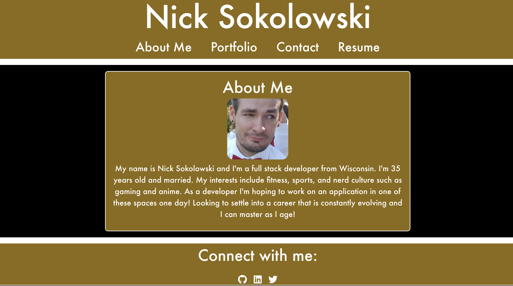

# Nick Sokolowski Portfolio
    A collection of projects using React!

## Description
  *  Use React to create a clean ui featuring deployed apps.
  *  Contact me section to reach out.
  *  Downloadable resume .pdf

  
  ## Table of Contents
  * [Installation](#installation)
  * [Usage](#usage)
  * [Contributing](#contribution)
  * [Questions](#questions)
  * [Obstacles](#obstacles-and-successes)
  
  ## Installation

  * The app is up and running on Netlify at 
  
  
  ## Usage
  * Internet required. 

  ## Contributing
  * Personal portfolio. Not contributions please. 

  ## License
   

This project is unlicensed. 

  
  ## Questions
  * Here is a link to my [GitHub](https://github.com/soko77788) profile.
  * For further questions email me at nicksokolowskidev7@gmail.com.

  ## Tools and 3rd party assistance
  * Built with React 
  * AI student helper tool and ChatGPT for react router and general concept refreshers. 

  ## Obstacles and Successes
  * Including all sorts of concepts including react router, components, pages.
  * Tediously getting everything linked to the correct location from github, deployed sites, linkedIn, and X.
  * Sizing images

  * Getting a solid resume and pdf created and added to the project.
  * Alignment looks crisp. 
  * Mapping over projects and creating cards with similar data amongst all projects.

  ## Deployed App

  
